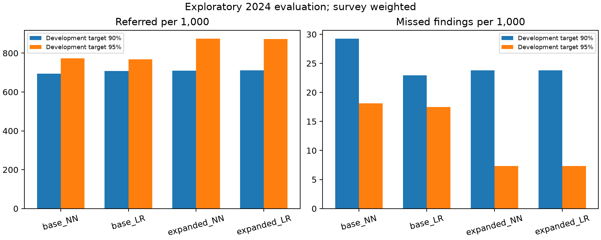
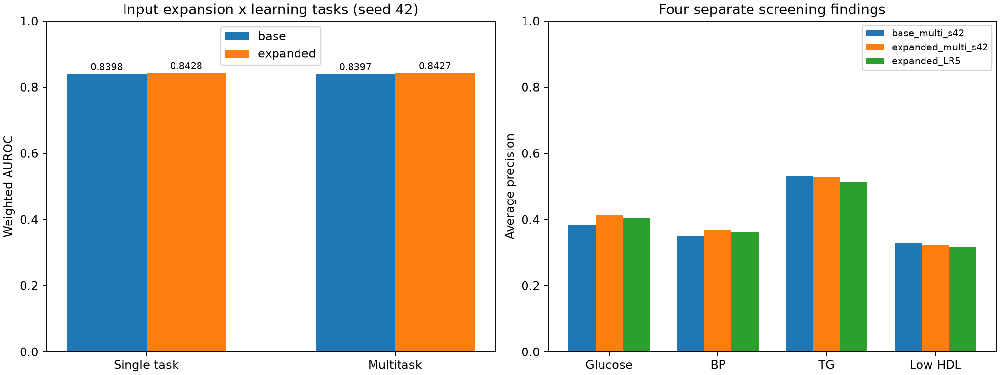

# KNHANES 청년층 미인지 대사이상 선별 연구

**비침습적 입력을 이용한 로컬 신경망과 로지스틱 회귀 비교, 가구유형 분석, 입력 확장 및 다중과제 실험**

국민건강영양조사 2021–2024년 자료로 만 19–39세의 현재 대사이상 소견을 선별하는 연구다. 조사 가중치를 적용한 로지스틱 회귀(LR), 트리 모델, 구조를 변형한 소형 신경망을 비교했다. 실험 정리 기준일은 2026-09-21이다.

> **현재 결론:** 종합 위험 판별력은 신경망과 LR이 거의 같다. 확장 다중과제 신경망은 일부 다중 출력 지표에서 조금 좋은 수치를 보였지만, 차이 구간 대부분이 0을 포함한다. 신경망의 확실한 우월성·임상적 유용성·진단 성능을 입증한 결과가 아니다. 2024년은 여러 실험에서 재사용한 탐색적 평가자료다.

이 저장소에는 **실험 코드, 테스트, 집계 결과, 그래프와 재현 절차만** 포함한다. 원시 건강자료, 개인별 예측·OOF·분할 목록, 학습 체크포인트 및 관계없는 발표자료는 포함하지 않는다.

## 2026-09-21 보완 연구: 조기선별·20/30대 가구·로컬 구조

**API 키나 외부 모델 호출 없이 공개된 구조 원칙만 로컬로 적용했다.** 기존 신경망의 한 번의 순전파에서 Noul·Choice·Score를 병렬로 구성하며 질문 추가·순서 변경은 기존 예측에 영향을 주지 않는다. 교사 출력이나 가중치를 사용하지 않았으므로 실제 지식 증류 또는 RLCD 재현은 아니다. [구조와 검증 상세](docs/LOCAL_STRUCTURE_V6.md).

### 조기선별 중심 재실험

학습 1,680명·검증 372명(2021–2022), 보정 481명·컷오프 529명(2023), 평가 1,006명(2024)을 분리하고 보정/컷오프 자료로 재학습하지 않았다. 이전 v4와 프로토콜이 다르므로 아래 수치를 v4의 순수 구조 효과로 비교하지 않는다. 2024년 재사용으로 **탐색적 결과**다.

| 확장 입력 모델 | 개발 민감도 목표 | 평가 민감도 | 특이도 | 검사 의뢰율 | 1,000명당 놓침 |
|---|---:|---:|---:|---:|---:|
| NN | 90% | 93.49% | 42.04% | 70.97% | 23.82 |
| LR | 90% | 93.49% | 41.88% | 71.07% | 23.82 |
| NN | 95% | 98.00% | 18.71% | 87.41% | 7.32 |
| LR | 95% | 98.00% | 18.82% | 87.34% | 7.32 |

조사 가중 결과다. NN−LR의 주요 선별 지표 차이 구간은 0을 포함한다. 신경망 우월성을 입증하지 못했으며, 높은 민감도에는 높은 검사 부담이 따른다. 확장 NN의 95 목표에서 민감도 95% 구간은 92.22–99.04%, 의뢰율 구간은 70.62–92.69%다. 전체 PSU 틀을 사용한 300회 재표집으로 보정·컷오프·평가 변동을 반영했지만 모델 선택/학습 불확실성과 유한모집단 보정은 포함하지 않았다.

[전체 표·결정곡선·민감도 분석](docs/SCREENING_V5.md) · [집계 JSON](results/screening_v5/report.json)



### 20·30대 1인가구 보완 연구

20–29세와 30–39세를 분리했다. 19세 134명은 별도다. `cfam`에 따른 **1인가구는 자취의 대리변수**로, 실제 부모와 별도 거주·기숙사·룸메이트·취사 여부를 직접 측정하지 않는다.

| 연령 | 다인가구 n / 가중 이상 비율 | 1인가구 n / 가중 이상 비율 |
|---|---:|---:|
| 20–29세 | 1,582 / 31.92% | 373 / 27.40% |
| 30–39세 | 1,701 / 45.71% | 278 / 47.09% |

미혼자 제한, 검사 조건에 따른 표본 탈락, 성별 교차 집계, 혼인·취업 등을 조정한 가중 연관 분석을 추가했다. 단순 차이 구간은 두 연령대 모두 0을 포함한다. 20대에서 조정 후 음의 연관성이 관찰됐지만 자취의 보호 효과로 해석할 수 없다.

**2024년 20대 1인가구는 95 목표에서도 민감도 89.34%**였으며, 개발 컷오프 표본의 해당 양성은 12명뿐이었다. 전체 민감도가 하위집단 성능을 보증하지 않는다. [가구유형 보완 보고서](docs/HOUSEHOLD_V5.md) · [집계 JSON](results/household_v5/report.json)

### 구조 적용 결과와 API

- `POST /v5/screen`: 기본/확장 NN, 개발 민감도 목표 90% 또는 95%.
- `POST /v6/decide-local`: 학습된 목표의 Noul·Choice·Score 질문을 한 순전파로 처리. [가상 요청](examples/local_v6_request.json) · [가상 응답](examples/local_v6_response.json).
- Noul은 확률만 반환하며 별도 confidence가 없다. Choice/Score의 confidence는 명시한 로컬 엔트로피 통계이며 보정된 정답률이 아니다. 이전 API 계약은 호환성을 위해 유지했다.
- 유효 입력 1,002명에서 확률 최대 차이 1.79×10⁻⁷, 선별 판정 변화 0건. 4명은 필요한 입력 보완 대상이다. 새 판별력 향상으로 보고하지 않는다.
- 결측·학습 범위·컷오프 근처·개발 하위집단 근거 부족을 검토 사유로 표시한다. **검토 대상을 모두 검사하면 95 정책 의뢰율이 99.33%**로 높아진다. 이는 비용 점검이며 권장 자동 의뢰 정책이 아니다.
- 7개 질문 로컬 p50 **0.2072 ms**, p95 **0.4022 ms**(워밍업 CPU 1스레드, 검증·추론·정책·JSON 포함, 로딩·HTTP 제외). 외부 Jev 또는 LR과의 동일조건 속도 비교가 아니다.

공식 설계 참고: [TypeSafe Introduction](https://docs.typesafe.ai/introduction), [Primitives](https://docs.typesafe.ai/primitives), [Confidence](https://docs.typesafe.ai/confidence), [Patterns](https://docs.typesafe.ai/patterns).

### 보완 연구 재현 순서

아래 8절의 자료 확보 및 v1 역할 분할 생성까지 먼저 수행한다. 기존 산출물은 덮어쓰지 않으므로 새 환경에서 기본 실행명을 사용한다. v5/v6만 재현할 때 v2–v4 학습은 필요하지 않다.

```powershell
python -m metabolic.train_screening --run-name screening_v5
python -m metabolic.household_followup --run-name household_v5
python -m scripts.screening_support_audit
python -m scripts.build_local_decisions --run-name typed_local_v6_groups
python -m scripts.report_followup
python -m pytest tests -q
```

공개 집계만으로 보고서를 다시 그리려면 `python -m scripts.report_followup --source results --destination docs`를 실행한다. 체크포인트와 개인별 자료는 공개 저장소에 없다. 로컬 테스트 **47개 통과**, 원자료/체크포인트가 없는 공개 패키지 테스트 **37개 통과·10개 건너뜀**을 확인했다. 건너뜀은 산출물 의존 통합 테스트이며 데이터 없는 학습 재현 성공을 뜻하지 않는다.

---

## 1. 연구 질문과 목표

1. 혈액검사를 입력하지 않고 현재 대사이상 소견을 선별할 수 있는가?
2. 소형 신경망이 동일 조건의 LR·트리 모델보다 유리한가?
3. 가구유형·성별·연령대에 따라 성능이 달라지는가?
4. 비침습적 입력 확장과 여러 소견의 공동 학습이 실제로 도움이 되는가?
5. 전처리·추론 병목을 줄이면서 예측값을 유지할 수 있는가?

목표변수는 다음 중 **하나 이상**을 만족하면 1이다.

| 소견 | 기준 |
|---|---|
| 공복혈당 이상 | `HE_glu >= 100` mg/dL |
| 혈압 이상 | `HE_sbp >= 130` 또는 `HE_dbp >= 85` mmHg |
| 중성지방 이상 | `HE_TG >= 150` mg/dL |
| 낮은 HDL | 남성 `HE_HDL_st2 < 40`, 여성 `< 50` mg/dL |

이는 **대사증후군 진단이나 미래 발병 예측이 아닌 단면 검사 이상 소견의 선별**이다. 검사 변수들은 목표 생성에만 사용하며 입력으로 넣지 않는다.

## 2. 데이터 및 연구 대상자

출처: [질병관리청 국민건강영양조사](https://knhanes.kdca.go.kr/knhanes/rawDataDwnld/rawDataDwnld.do). 각 연도 기본DB의 SPSS 원본을 사용했다.

| 연도 | 전체 참여자 | 19–39세 | 주 연구 코호트 |
|---|---:|---:|---:|
| 2021 | 7,090 | 1,414 | 1,039 |
| 2022 | 6,265 | 1,284 | 1,013 |
| 2023 | 6,929 | 1,290 | 1,010 |
| 2024 | 6,997 | 1,353 | 1,006 |
| **합계** | **27,281** | **5,341** | **4,068** |

주 분석에서는 세 질환의 **의사진단 경험 없음**, 관련 약물·인슐린 미사용, 임신개월수 비기록, 12시간 이상 공복, 목표 검사값 완비, 유효한 표본설계 정보를 요구했다. 전용 복약 변수를 사용하며 `*_pt` 치료 여부와 구분했다.

- ‘진단 경험 없음’은 미인지의 **대리 정의**다. 검사 수치 자체를 알고 있는지 직접 측정한 것은 아니다.
- 목표 검사 결측을 정상으로 처리하지 않았다.
- 높은 혈당·TG 같은 실제 이상값을 임의 제거하지 않았다.
- 예측변수 결측은 학습 자료에만 적합한 대치기로 처리했다.
- 학습·평가에는 `wt_itvex`를 사용했다. 구간 추정은 층별 PSU bootstrap의 탐색적 결과이며 정식 복합표본 domain 분산 추정을 대신하지 않는다.

파일 해시·크기·행/열 수: [data_manifest.json](results/data_manifest.json). 자세한 확보 절차: [DATA_SETUP.md](docs/DATA_SETUP.md).

## 3. 입력 변수

### 기본 입력 10개

`age`, `sex`, `incm`, `edu`, `HE_BMI`, `HE_wc`, `WHtR`, `sm_presnt`, `dr_month`, `pa_aerobic`.

`WHtR = HE_wc / HE_ht`로 계산한다. API는 신장을 받아 비율을 계산한다. `incm`은 개인소득 **4분위**다.

### 확장 입력 9개

| 모델 입력 | 원자료 | 의미·코딩 |
|---|---|---|
| `sedentary_hours` | `BE8_1`, `BE8_2` | 하루 앉아 있는 시간, 시간+분/60 |
| `walking_days` | `BE3_31` | 실제 0–7일로 변환 |
| `stress_level` | `BP1` | 1=매우 높음, 4=거의 없음 |
| `employed` | `EC1_1` | 0=미취업, 1=취업 |
| `alcohol_frequency` | `BD1`, `BD1_11` | 0=지난 1년 비음주부터 5=주4회 이상 |
| `alcohol_amount` | `BD1`, `BD1_11`, `BD2_1` | 0=비음주, 1=1–2잔 … 5=10잔 이상 |
| `strength_days` | `BE5_1` | 0–5 범주, 5는 5일 이상 |
| `family_history` | `HE_fh` | 만성질환 진단 가족력 0/1 |
| `living_alone` | `cfam` | 1인 가구 0/1 |

모름·무응답·비해당 코드를 일괄적으로 0으로 바꾸지 않았다. 비음주가 확인되는 문항 분기에서만 음주 비해당을 비음주로 변환했다. 걷기·근력·좌식시간·가족력의 비해당/무응답은 별도로 결측 처리했다.

수면은 2024년 질문 방식이 바뀌어 제외했다. 영양조사 변수는 참여자 및 가중치 변경이 필요해 이번 확장에서 제외했다. 연도별 결측과 변환 규칙은 [feature_audit.json](results/expanded_multitask_v4/feature_audit.json)에 있다.

## 4. 실험 과정

| 단계 | 질문·변경 | 모델 개발 및 검증 |
|---|---|---|
| v1 | 비침습적 변수만으로 선별 가능한가? | 16개 이상 소견 조합을 한 번에 예측하는 MLP |
| 비교·가구 분석 | LR/RF/XGBoost/LightGBM과 비교, 가구별 차이 | 동일 코호트·분할·가중치, Youden/민감도90% 정책 비교 |
| v2 | 전처리 병목 제거, 종합 위험 직접 학습 | 배열 추론, 결측 지시자·hinge 기저, 종합 위험+조건부 조합 |
| v3 | 대사이상에 맞춘 구조와 개발 표본 확대 | 신체계측·인구학·생활습관 경로, 3,062명 개발, OOF 보정 |
| v4 | 입력 확대와 공동 학습의 효과 분리 | 기존/확장 입력 × 단일/다중과제의 2×2 실험, 3개 시드 |

### 초기 분할: v1·동일조건 비교

| 역할 | 연도 | n |
|---|---|---:|
| 경사 학습 | 2021–2022 | 1,680 |
| 조기종료 | 2021–2022 | 372 |
| 확률 보정 | 2023 | 481 |
| 컷오프 결정 | 2023 | 529 |
| 평가 | 2024 | 1,006 |

v2는 2021–2022년 2,052명 내부에서 그룹 교차검증으로 후보를 고른 후 전체 개발 표본에 재학습했다. 보정·컷오프·평가 역할은 유지했다.

### 확대 분할: v3·v4

2021–2023년 **3,062명**으로 개발하고 2024년 1,006명을 평가했다.

- 3-fold `StratifiedGroupKFold`, 연도+PSU 기준으로 학습/검증 중복 차단.
- NN의 조기종료는 fold 내부의 별도 그룹 분할에서 결정한 뒤 outer train에 재학습.
- 각 사람 및 같은 PSU를 학습하지 않은 모델에서 얻은 **OOF 예측** 사용.
- OOF 예측 중 PSU 기준 1,782명은 보정, 1,280명은 컷오프 결정에 사용.
- 선택된 구조를 3,062명에 최종 재학습하고 OOF에서 구한 보정값을 적용.

OOF 모델과 최종 모델의 학습량 차이로 보정값 이전에 한계가 있다. 후보 선택과 보정에 개발 자료를 재사용하므로 내부 추정은 독립 외부 검증이 아니다. **2024년은 이전 실험에서 이미 확인했으며, 이번 구조 선택에는 사용하지 않았지만 결과는 탐색적이다.**

## 5. 신경망 구조와 출력

### v1 → v2

v1은 16개 조합의 공동확률을 예측하는 MLP다. v2는 ‘하나 이상의 이상’ 확률 `r`을 직접 최적화하고, 양성일 때의 15개 조합 분포 `q`를 학습한다.

`P(정상)=1-r`, `P(양성 조합 j)=r*q_j`이므로 여러 출력이 동일한 공동분포에서 나온다. v2의 조건부 head는 종합 위험 분기를 고정한 뒤 별도로 보완해 미학습 상태로 남지 않게 했다.

### v3·v4

신체계측·인구학·생활습관을 별도 소형 인코더로 처리하고, 신체계측×인구학/생활습관 표현을 결합한다. 안정적인 초기값으로 학습 자료에 적합한 LR 계수를 사용한 후 NN을 학습한다. **로지스틱 초기화를 사용하는 신경망**이며 독자적인 생리 기전이 입증된 구조는 아니다.

v3에서는 6개 변형을 개발 CV로 비교했다. 선택 모델은 소견 쌍별 추가 출력항을 제외한 그룹 구조이며 **477개 파라미터**를 가진다(v1 3,112개, v2 2,480개). 복잡한 구조가 항상 유리하지는 않았다.

v4는 다음을 통제했다.

- 단일과제: 종합 위험 라벨만 사용. 소견 라벨을 초기화·손실·조기종료에 사용하지 않음.
- 다중과제: 종합 위험과 혈당·혈압·TG·HDL 소견을 공동 학습.
- 두 조건의 조기종료 기준은 종합 위험 BCE로 동일.
- 기존/확장 입력 각각에 시드 42·43·44를 모두 적용. 가장 좋은 시험 시드를 고르지 않음.
- LR도 입력별로 **종합 위험+네 소견의 5개 모델**을 독립적으로 학습하고 출력별 C를 개발 OOF에서 선택.

### 반환값

- **Choice:** 선별 양성/음성. 컷오프 정책에 따라 확률 0.5 미만에서도 양성일 수 있음.
- **Noul:** 하나 이상의 이상 소견 확률과 컷오프 적용 결과.
- **Score:** 예상 이상 항목 수 0–4 및 개수 분포. 질환 발생 확률과 구분.
- 네 소견별 확률. `confidence`는 출력 범주에 배정한 확률로, 정확성 보증이나 별도 인식론적 불확실성 추정이 아님.

단일과제 모델은 학습하지 않은 소견 확률을 제공하지 않는다. Jev의 병렬·타입 제한 출력 아이디어를 참고했지만 **Jev 원본 모델이나 RLCD 재현물은 아니다**. 사용한 학습법은 지도학습과 확률 보정이다.

## 6. 결과

모든 주 지표는 조사 가중치를 적용했다. AP는 `average_precision_score` 방식이다. **AUC 0.84는 정확도 84%라는 뜻이 아니다.**

### 6.1 초기 동일조건 알고리즘 비교

| 모델 | AUROC | AP | Youden 민감도 | Youden 특이도 |
|---|---:|---:|---:|---:|
| 병렬 NN v1 | 0.8321 | 0.7550 | 73.0% | 77.7% |
| Logistic Regression | 0.8307 | 0.7447 | 73.3% | 78.3% |
| Random Forest | 0.8092 | 0.7293 | 73.2% | 75.7% |
| XGBoost | 0.7838 | 0.6927 | 71.3% | 70.1% |
| LightGBM | 0.8021 | 0.7144 | 73.6% | 75.0% |

NN과 LR의 AUC 차이 구간은 0을 포함했다. 모든 가능한 튜닝 조건에서의 우월성 검증이 아니라 고정 설정의 비교다. 컷오프는 시험 데이터가 아닌 별도 개발 역할에서 정했다.

### 6.2 구조 변경·학습량 확대

| 모델 | 최종 학습 n | AUROC | AP | Brier ↓ |
|---|---:|---:|---:|---:|
| v1 | 1,680 | 0.8321 | 0.7550 | 0.15671 |
| v2 | 2,052 | 0.8345 | 0.7544 | 0.15565 |
| v3 | 3,062 | 0.8398 | 0.7525 | 0.15563 |
| v3와 동일 조건의 튜닝 LR | 3,062 | 0.8403 | 0.7495 | 0.15573 |

버전 간 변화에는 구조뿐 아니라 학습량·보정 방식 변경이 함께 포함된다. AUC 상승 전부를 구조 효과로 해석하지 않는다. AP까지 일관되게 상승한 것도 아니다.

### 6.3 v4: 입력 확장 × 학습 과제

기준 시드42의 2024년 결과다. 세 시드의 전체 결과는 [v4 report.json](results/expanded_multitask_v4/report.json)에 있다.

| 조건 | 개발 CV 평균 AUC | 평가 AUC | 종합 AP | 네 소견 평균 AP |
|---|---:|---:|---:|---:|
| 기존 입력·단일과제 NN | 0.77581 | 0.83979 | 0.75276 | 해당 없음 |
| 기존 입력·다중과제 NN | 0.77576 | 0.83975 | 0.75240 | 0.39757 |
| 확장 입력·단일과제 NN | 0.77399 | 0.84282 | 0.75345 | 해당 없음 |
| **확장 입력·다중과제 NN** | **0.77418** | **0.84272** | **0.75344** | **0.40843** |
| 확장 입력·독립 LR 5개 | 출력별 OOF 선택 | 0.84266 | 0.75160 | 0.39870 |



**해석:**

- 입력 확장 시 2024년 AUC는 조금 올랐지만 개발 CV에서는 개선되지 않았다. 안정적인 일반화 이득이 확인된 것은 아니다.
- 다중과제가 종합 위험 AUC를 높이지는 않았다.
- 확장 다중 NN의 네 소견 평균 AUC/AP/Brier는 확장 LR들보다 조금 좋았지만, 차이 구간 대부분이 0을 포함했다.
- 확장 후 **HDL 판별력은 낮아졌다**. 모든 소견이 좋아진 것은 아니다.

| 네 소견 평균 지표 | 확장 다중 NN | 확장 독립 LR 5개 |
|---|---:|---:|
| AUC ↑ | 0.81133 | 0.80813 |
| AP ↑ | 0.40843 | 0.39870 |
| Brier ↓ | 0.09948 | 0.10004 |

평균 지표는 종합 위험을 제외한 네 소견의 단순 평균이다. 소견별 유병률이 달라 종합 위험 AP와 직접 비교하지 않는다.

| 차이: 확장 다중 NN − LR | 탐색적 95% 구간 |
|---|---|
| 종합 AUC | −0.00248 ~ +0.00259 |
| 네 소견 평균 AUC | −0.00007 ~ +0.00663 |
| 네 소견 평균 AP | −0.00043 ~ +0.01717 |
| 네 소견 평균 Brier | −0.00122 ~ +0.00016 |

예상 이상 항목 수 MAE 차이는 해당 탐색 비교에서 음수 구간을 보였으나, 이를 전체 임상 우월성으로 확대 해석하지 않는다. [다중 출력 구간 전체](results/expanded_multitask_v4/multioutput_uncertainty.json).

### 6.4 입력 기여와 출력 일관성

2024년을 사용하지 않은 OOF 순열 분석에서 **음주 상세와 근력운동 정보**의 상대적 기여가 가장 컸지만 효과는 작았다. 중요도를 보고 시험 성능을 높이는 재선택은 하지 않았다. [분석 결과](results/expanded_multitask_v4/extra_feature_importance.json).

공동분포를 사용하는 NN은 `max(성분확률) ≤ 하나 이상 확률 ≤ min(1, 성분확률 합)`을 만족한다. 확장 NN의 관계 위반은 0건, 독립적으로 학습·보정한 LR 5개는 41건이었다. 이는 환자 오분류 건수가 아니라 **확률 출력들 사이의 관계**다. LR도 공동분포나 보정으로 일관성을 맞출 수 있으므로 NN만 가능한 기능이라고 주장하지 않는다.

## 7. 가구유형·하위집단 분석

`cfam=1`을 1인 가구, 2–6을 다인 가구로 분류하고 `genertn`과 교차 확인했다. 6은 6명 이상이다. 미상은 다인 가구로 강제 분류하지 않았다.

| 주 코호트 | 4개년 n | 가중 이상 소견 비율 | 2024년 평가 n |
|---|---:|---:|---:|
| 1인 가구 | 658 | 36.3% | 189 |
| 다인 가구 | 3,410 | 38.3% | 817 |

초기 가구 분석에서 1인 가구 대상 AUC는 기존 통합 NN 0.7912, 가구정보 추가 NN 0.8018, 1인 가구 전용 NN 0.7825였다. 별도 전용 모델이 더 좋지 않았다. 가구 추가 효과는 시드에 따라 달랐다.

성별×연령×가구유형 결과와 불안정한 소표본 표시를 집계 파일에 저장했다. **1인 가구를 자취와 동일시하거나, 집단 간 비율 차이를 자취의 인과효과로 해석하지 않는다.** 오즈비는 비가중 완전사례 로지스틱 최대우도 및 PSU 군집 표준오차의 탐색 분석이며, 오즈비를 위험률의 배수로 해석하지 않는다.

자료: [가구 감사](results/comparison_household_v1/household_audit.json), [하위집단·관련성 결과](results/comparison_household_v1/report.json), [하위집단 구간](results/comparison_household_v1/subgroup_uncertainty.json).

## 8. 추론 병목과 속도

기존 실행에서 대부분의 시간은 매 요청의 DataFrame 생성과 범용 sklearn 전처리에 사용됐다. 학습된 대치값·스케일·원핫 범주를 배열 연산으로 옮기고, 작은 NN도 NumPy 실행으로 내보냈다.

같은 기존 NN을 비교한 최적화 실험에서 **4.053ms → 0.088ms**, 약 46배 개선됐다. 4,068명에서 확률 최대 차이는 `4.17e-7`, 저장 컷오프 기준 판정 변화는 0건이었다. [병목 측정](results/optimized_v2/latency.json).

v4의 동일 조건 비교는 검증·전처리 1회·종합/네 소견 확률·기대 개수·JSON 출력을 포함한다. LR도 전처리를 한 번만 수행했다.

| v4 실행 | 중앙값 | p95 |
|---|---:|---:|
| 확장 다중 NN | 0.0642ms | 0.1062ms |
| 확장 LR 5개 | 0.0483ms | 0.0797ms |

warm CPU 1스레드·1,000회 측정이며 로딩·서버 시작·HTTP는 제외했다. **NN이 LR보다 빠르다는 결과는 아니다.** 시점이 다른 벤치마크의 시간끼리는 직접 속도비를 계산하지 않는다. [v4 측정 원본](results/expanded_multitask_v4/latency.json).

## 9. 실행 및 재현

### 환경과 원자료 없는 테스트

테스트에 사용한 환경은 Windows, Python 3.13, PyTorch 2.8.0이며 계산은 CPU에서 수행했다. `requirements-tested.txt`는 확인한 직접 의존성 버전 목록으로 전체 전이 의존성 잠금 파일은 아니다.

```powershell
python -m venv .venv
.\.venv\Scripts\Activate.ps1
python -m pip install -r requirements-tested.txt
python -m pytest tests -q
```

원래 로컬 환경에서는 **35개 테스트가 통과**했다. 공개 저장소에는 체크포인트·개인별 분할 자료가 없으므로 이에 의존하는 통합 테스트는 건너뛴다. 합성 fixture 기반 전처리·모델·출력 제약 테스트는 원자료 없이 실행된다. 전체 실험을 만든 뒤 실행하면 통합 테스트도 활성화된다.

공개용 깨끗한 사본에서도 **27 passed, 8 skipped**를 확인했다. 건너뛰기는 성공한 모델 재검증으로 세지 않는다.

### 전체 실험 재현 순서

먼저 [원자료 확보 안내](docs/DATA_SETUP.md)에 따라 4개 ZIP을 `data/raw/knhanes/`에 넣는다. 출력 폴더가 이미 있으면 덮어쓰지 않고 중단하므로, 아래 표준 이름은 깨끗한 실행에서 사용한다.

```powershell
python -m scripts.validate_knhanes

# v1 및 고정 비교 분할 생성
python -m metabolic.train --run-name local_parallel_v1_run2

# 공개 비교 노트북: 고정 커밋을 읽기용으로만 확보
python -m scripts.fetch_peer_reference
python -m metabolic.comparison --run-name comparison_household_v1
python -m scripts.comparison_diagnostics
python -m scripts.report_comparison

# 병목 및 primary-risk 변형
python -m metabolic.optimize --run-name optimized_v2
python -m scripts.complete_refined_heads
python -m scripts.benchmark_optimized
python -m scripts.report_optimization

# 2021–2023 개발 자료로 확대한 특화 구조
python -m metabolic.train_specialized --run-name specialized_v3
python -m scripts.benchmark_specialized
python -m scripts.report_specialized

# 입력 확장 × 단일/다중과제 실험
python -m metabolic.train_factorial --run-name expanded_multitask_v4
python -m scripts.factorial_diagnostics
python -m scripts.benchmark_factorial
python -m scripts.report_factorial

python -m pytest tests -q
```

각 실행은 `data/`, `artifacts/`에 로컬 파일을 생성한다. 공개한 과거 집계 결과는 `results/`에 별도로 보관하며 재실행 결과로 덮어쓰지 않는다. 소프트웨어·하드웨어·원자료 개정에 따른 차이를 해시와 설정으로 확인해야 한다.

### 추론과 API

체크포인트를 생성한 후 실행한다. 예제는 실제 참여자가 아닌 가상 사례다.

```powershell
python -m metabolic.expanded --artifact artifacts/expanded_multitask_v4/models/expanded_multi_s42 --input examples/expanded_request.json --policy youden

# 사용자가 실행하는 로컬 서버, 기본적으로 localhost만 바인딩
python -m uvicorn metabolic.api:app --host 127.0.0.1 --port 8000
```

| 경로 | 기능 |
|---|---|
| `POST /v1/decide` | 기존 NN의 고속 실행 |
| `POST /v1/decide-household` | 초기 가구정보 추가 모델 |
| `POST /v2/decide` | primary-risk 변형 |
| `POST /v3/decide` | 그룹·다중과제 특화 모델 |
| `POST /v4/decide-expanded` | 19개 입력 확장 다중과제 모델 |

v4는 `state`와 `policy`(`youden` 또는 `sensitivity90`)를 받는다. 모르는 추가 항목은 생략/null로 전달하며 반환된 `missing_inputs`를 확인한다. 원시조사의 8/9/88/99 코드를 API에 직접 넣지 않는다. 음주 빈도·양·월간 음주 여부의 모순과 검사값 같은 허용되지 않은 입력은 거부한다.

예제: [요청](examples/expanded_request.json), [응답](examples/expanded_response.json). 서버 배포는 수행하지 않았다.

## 10. 저장소 구성

```text
metabolic/             전처리, 모델, 실험 파이프라인, 로컬 API
scripts/               자료 검증, 진단·보고서 생성, 벤치마크
tests/                 합성 단위 테스트 및 로컬 산출물 통합 테스트
results/               공개 가능한 집계 JSON·그래프·파일 해시
examples/              가상 입력/응답
docs/DATA_SETUP.md     공식 자료 확보 및 검증 절차
```

핵심 집계 결과:

- [v1](results/local_parallel_v1_run2/report.json)
- [동일조건·가구 분석](results/comparison_household_v1/report.json)
- [v2 최적화](results/optimized_v2/report.json)
- [v3 특화 구조](results/specialized_v3/report.json)
- [v4 입력 확장·다중과제](results/expanded_multitask_v4/report.json)

집계 파일의 과거 소스 해시는 해당 실험 당시 코드의 지문이다. 공개용 테스트 건너뛰기·경로 안내 등의 패키징 변경으로 현재 공개 코드 해시와 다를 수 있다. 개인별 원본 예측·분할 목록은 포함하지 않았다.

## 11. 해석의 경계와 참고

- 단면 선별 연구이며 미래 발병·진단·실제 검진 의뢰의 임상적 효과를 입증하지 않는다.
- 검진자가 측정한 신체계측으로 학습했으므로 자가 측정 오차에 대한 검증이 별도로 필요하다.
- 완전 검사·공복·진단 제외 조건에 따른 선택편향 가능성이 있다.
- 효과 크기가 작고 일부 소견은 악화했다. 변수·파라미터·과제를 늘리면 항상 좋아진다는 결론을 내리지 않는다.
- 2024년을 반복 확인했으므로 다음 확증은 아직 보지 않은 외부 표본에서 해야 한다.

공식 자료: [KNHANES 원시자료](https://knhanes.kdca.go.kr/knhanes/rawDataDwnld/rawDataDwnld.do), [이용지침서](https://knhanes.kdca.go.kr/knhanes/dataAnlsGd/utztnGd.do).

비교 설계 참고: [동료 공개 연구 저장소의 고정 커밋](https://github.com/kdw123654/digital-project/tree/008ebf84c66cb0b92e357d8212a0d2c2333022bd). 보고된 AUC와 직접 승패 비교하지 않고 코호트·분할·가중치·컷오프 역할을 맞춰 재평가했다. 공개 노트북에서 확인한 시험집합 컷오프 선정과 연령별 훈련 AUC를 그대로 재현해 성과로 주장하지 않았다.

인터페이스 개념 참고: [TypeSafe의 Jev 소개](https://typesafe.ai/blog/introducing-system-one-models-and-jev). 본 저장소는 독립적인 로컬 연구 구현이며 Jev/RLCD 복제나 임상 인증 제품이 아니다.
