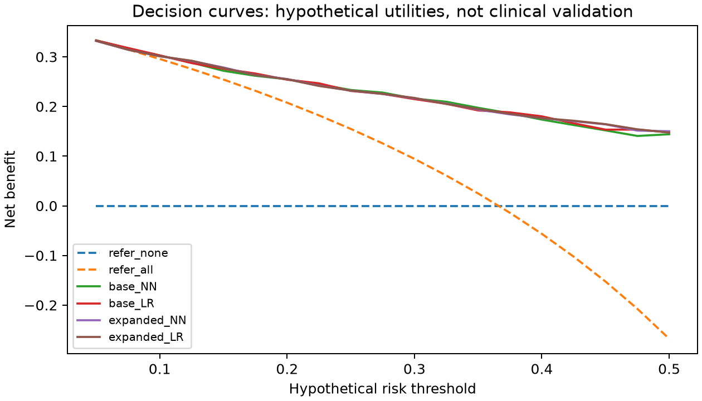

# 조기선별 보완 실험 v5

2026-09-21. 목표는 현재 검사 이상 소견의 선별이며 미래 발병 예측이나 진단이 아니다. 2024년 평가자료를 이전 실험에서 반복 확인했으므로 이번 결과 역시 탐색적이다.

## 설계

학습 1,680명·검증 372명(2021–2022), 확률 보정 481명·컷오프 선정 529명(2023), 평가 1,006명(2024)으로 역할을 분리했다. 보정·컷오프 자료로 재학습하지 않았다. 기본/확장 입력별 NN과 LR을 비교하고 검증자료의 민감도 90%·95% 지점 평균 특이도로 후보를 선정했다. 90/95는 개발자료에서의 목표이며 새 사람이나 하위집단의 민감도 보증이 아니다.

층별 전체 PSU 틀(분석 대상이 없는 PSU 포함)을 사용한 300회 재표집으로 보정·컷오프·평가의 변동을 반영했다. 각 층에서 n−1개 PSU를 복원추출하고 n/(n−1) 배율을 적용했다. 모델 학습·선택의 불확실성은 포함하지 않았다. 유한모집단 보정 없는 Rao–Wu 방식의 근사이며 공식 복제 가중치는 아니다.

## 2024년 조사 가중 성능

| 입력·모델 | 개발 목표 | 실제 민감도 | 특이도 | 검사 의뢰율 | PPV | NPV | 1,000명당 놓침 |
|---|---:|---:|---:|---:|---:|---:|---:|
| base_NN | 90% | 92.01% | 43.74% | 69.35% | 48.58% | 90.46% | 29.24 |
| base_NN | 95% | 95.05% | 32.81% | 77.39% | 44.97% | 91.98% | 18.14 |
| base_LR | 90% | 93.73% | 42.57% | 70.72% | 48.52% | 92.16% | 22.96 |
| base_LR | 95% | 95.22% | 33.74% | 76.86% | 45.36% | 92.44% | 17.49 |
| expanded_NN | 90% | 93.49% | 42.04% | 70.97% | 48.23% | 91.79% | 23.82 |
| expanded_NN | 95% | 98.00% | 18.71% | 87.41% | 41.05% | 94.19% | 7.32 |
| expanded_LR | 90% | 93.49% | 41.88% | 71.07% | 48.16% | 91.76% | 23.82 |
| expanded_LR | 95% | 98.00% | 18.82% | 87.34% | 41.08% | 94.22% | 7.32 |

동일 입력의 NN−LR 차이에 대한 paired 구간은 주요 선별 지표에서 0을 포함했다. 이번 결과로 신경망 우월성을 주장하지 않는다. v4와는 학습/보정 역할 및 모델 선정 기준이 달라 수치 변화 전체를 구조 효과로 해석할 수 없다.

### 확장 신경망의 불확실성과 하위집단

| 개발 목표 | 민감도 95% 구간 | 검사 의뢰율 95% 구간 |
|---|---|---|
| 90% | 86.66%–97.30% | 58.13%–79.30% |
| 95% | 92.22%–99.04% | 70.62%–92.69% |

| 평가 집단 | n | 양성 n | 90 목표 실제 민감도 | 95 목표 실제 민감도 | 95 목표 의뢰율 |
|---|---:|---:|---:|---:|---:|
| 20–29세 다인가구 | 409 | 111 | 89.46% | 98.14% | 81.28% |
| 20–29세 1인가구 | 111 | 23 | 84.51% | 89.34% | 76.79% |
| 30–39세 다인가구 | 387 | 165 | 98.07% | 99.48% | 95.16% |
| 30–39세 1인가구 | 76 | 34 | 93.95% | 95.38% | 95.48% |

특히 20대 1인가구는 95 목표에서도 실제 민감도 89.34%였다. 2023년 컷오프 자료의 20대·30대 1인가구 양성은 각각 12명·17명에 불과했다. 개발 집단의 근거 부족을 표시하되 평가자료를 보고 집단별 컷오프를 맞추지 않았다.

## 결정곡선과 민감도 분석

공통 위험 임계값 0.05–0.50에서 전원 검사·검사 없음과 순편익을 비교했다. 이는 가정한 위해/이득 비율에 따른 계산이며 실제 임상 개입 효과나 최적 컷오프의 증명이 아니다.

8시간 이상 공복 코호트와 미치료 코호트는 동결 모델·동결 컷오프로만 재평가했다. 전체 집계, 비가중 결과, 하위집단 구간, 대체 코호트 결과는
[원본 집계](../results/screening_v5/report.json)에 보존했다.

방법 참고: [결정곡선 원 논문](https://pmc.ncbi.nlm.nih.gov/articles/PMC2577036/), [rescaled bootstrap 설명](https://github.com/dfeehan/surveybootstrap/blob/main/vignettes/rescaled_bootstrap.Rmd).
